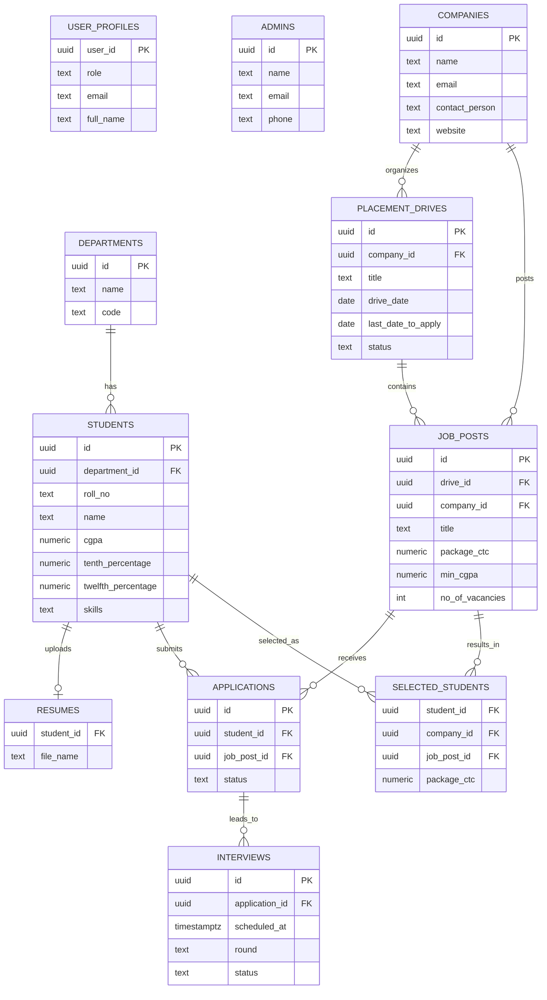

# Campus Placement Management System

A web app to manage campus placement activity in one place: students, companies, job postings, applications, and placement outcomes.

**Live demo:** https://campus-placement-management-system-rho.vercel.app


## Features

- Role-based access for admin, company and student users
- Placement drives with multiple job posts per drive
- Student applications with status tracking (pending, shortlisted, selected, rejected)
- Interview scheduling (round, venue, date)
- Selected-students records with package details
- Eligibility criteria (minimum CGPA, departments)
- Seed function to load demo data (50 students, 10 companies, 20 drives)
## Tech Stack

| Layer | Technology |
|-------|------------|
| Frontend | React, TypeScript, Vite |
| Styling | Tailwind CSS |
| Backend / Database | Supabase (PostgreSQL) |
| Deployment | Vercel |
| Tooling | ESLint |

## Database Design



`user_profiles` maps each login to a role (`admin`, `company` or `student`). `admins`, `companies` and `students` extend it.

Schema and migrations live in the [`supabase/`](./supabase) folder.


## Getting Started

**Prerequisites:** Node.js 18+ and a free [Supabase](https://supabase.com) project.

```bash
# 1. Clone
git clone https://github.com/Muskii9/campus-placement-management-system.git
cd campus-placement-management-system

# 2. Install dependencies
npm install

# 3. Set environment variables (create a .env file in the root)
VITE_SUPABASE_URL=your_supabase_project_url
VITE_SUPABASE_ANON_KEY=your_supabase_anon_key

# 4. Apply the schema from supabase/ to your Supabase project

# 5. Run locally
npm run dev
```

> Never commit your `.env` file. It is listed in `.gitignore`.

## Project Structure

```
├── src/         # React components, pages, and app logic
├── supabase/    # Database schema and migrations
├── index.html
└── vite.config.ts
```

## Future Improvements

- Email notifications for new job postings
- Resume upload and shortlisting filters
- Analytics dashboard for placement trends

## Author

**Muskan Gupta**
[GitHub](https://github.com/Muskii9) · [LinkedIn](https://www.linkedin.com/in/muskan-gupta-385a0b298/)
